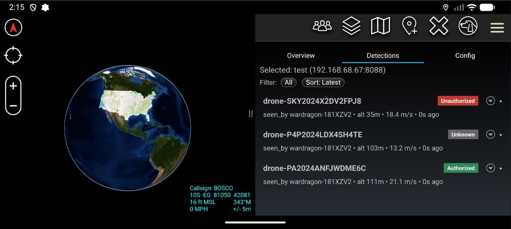
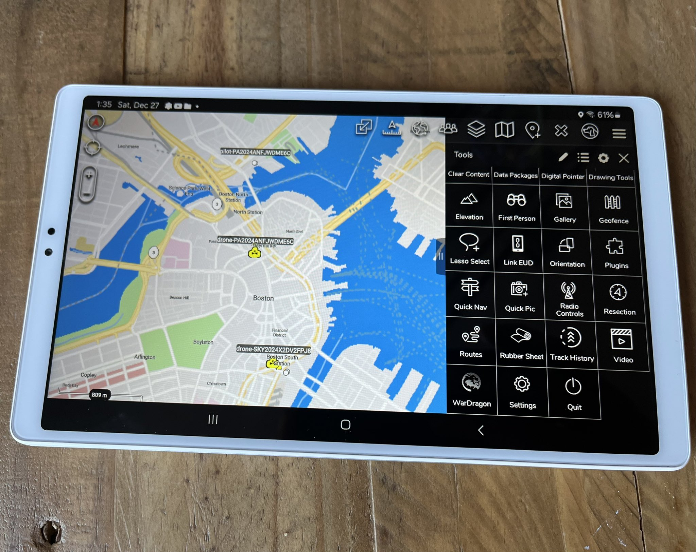

# WarDragon ATAK Plugin (Binary Distribution)

WarDragon is an ATAK plugin for monitoring WarDragon Pro kits via DragonSync:
- Manage kits (host/port or CoT-only via **Manage → Discovered**)
- Detections (drones/aircraft) with basic track replay and per-track status tags (Authorized/Unknown/Unauthorized)
- Status and config view with track refresh/TTL settings (optional TTL for CoT detections)
- CoT-aware: uses CoT when available to reduce API polling

## Requirements
- ATAK-CIV 5.6.x (built against SDK 5.6.0)
- Android 8+
- DragonSync running on the kit (WarDragon Pro ships with it)

## Install
1) Download the APK from GitHub Releases:  
   - Release page: https://github.com/alphafox02/WarDragon-ATAK-Plugin/releases  
   - Current: `ATAK-Plugin-WarDragon-0.2-5.6.0-civ-release.apk`
2) Verify checksum (recommended):  
   - SHA256: `bcddfec281625feb1eb7cdeedeb28e5c2f7b25b3d9b0472a207c85018f57f94e`
3) Sideload onto your ATAK device and enable the plugin.

## Quick Start
1) Open WarDragon in ATAK.
2) Go to **Overview → Manage**, add kit name/host/port, or use **Manage → Discovered** if kits appear via CoT.
3) Select a kit to view **Status**, **Detections**, and **Config**.
4) CoT-live kits auto-pause API polling for tracks.

## Using the Plugin
- **Overview/Manage:** Add/edit kits (host/port or CoT-only). Use **Discovered** to link kits seen via CoT. Track refresh interval is saved locally.
- **Detections:** Filter All/Drones/Aircraft. Tap a row to expand details (map center, pilot/home, replay). Set per-track status via the overflow menu (Authorized/Unknown/Unauthorized). RID make/model/source shown when provided by DragonSync. Sort pill toggles Latest vs Stable order.
- **Config:** Read-only kit config from the API. Local settings: track refresh interval; track TTL (minutes) for API detections; optional toggle to apply TTL to CoT detections list. CoT/debug toggles live here.

## Screenshots

## Notes
- Designed for WarDragon Pro. Requires DragonSync on the kit.  
  DragonSync project: https://github.com/alphafox02/DragonSync
- CoT-only still shows status/detections; API is required for Config.

## Roadmap / Feedback
- Geofence alerts, richer diagnostics, and other enhancements are being evaluated.  
- Feedback is welcome—please share issues/requests to help prioritize.

## Releases & Source
- Binary-only distribution. Source code is not published at this time; licensing may change in the future.
- Copyright © 2025 CEMAXECUTER LLC. All rights reserved.
- If you installed any early pre-release builds, uninstall them before installing this release (signing keys changed).

## Support
- Issues/feedback: open a GitHub issue.
